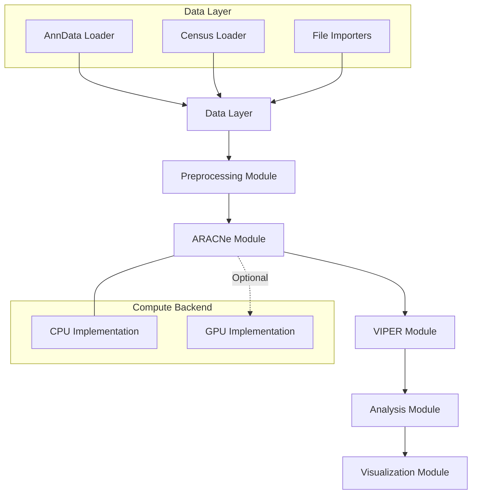

# PySCES: Detailed Implementation Plan

## 1. Project Overview

**Project Name:** PySCES (Python Single-Cell Expression System)  
**Description:** Python port of PISCES regulatory network pipeline with CELLxGENE Census integration  
**Timeline:** 6-8 months total (3 phases)  
**Primary Goal:** Create a modern, modular Python implementation of the PISCES pipeline with feature parity and improved user experience

## 2. System Architecture



## 3. Project Setup & Infrastructure (Weeks 1-2)

### 3.1 Repository Structure

```
pysces/
├── .github/                      # GitHub Actions workflows
├── docs/                         # Documentation
├── examples/                     # Example notebooks
├── pysces/                       # Main package
│   ├── __init__.py
│   ├── data/                     # Data handling
│   │   ├── __init__.py
│   │   ├── loaders.py            # Various data loaders
│   │   ├── census.py             # Census integration
│   │   └── preprocessing.py      # QC and preprocessing
│   ├── aracne/                   # ARACNe implementation
│   │   ├── __init__.py
│   │   ├── core.py               # Python interface
│   │   ├── _cpp/                 # C++ extensions
│   │   └── gpu.py                # GPU implementation (Phase 3)
│   ├── viper/                    # VIPER implementation
│   │   ├── __init__.py
│   │   ├── regulons.py           # Regulon handling
│   │   └── activity.py           # Activity inference
│   ├── analysis/                 # Analysis tools
│   │   ├── __init__.py
│   │   ├── clustering.py         # Clustering methods
│   │   └── master_regulators.py  # MR identification
│   └── plotting/                 # Visualization
│       ├── __init__.py
│       └── plots.py              # Standard plots
├── tests/                        # Test suite
├── setup.py                      # Package metadata
├── pyproject.toml                # Build system config
├── environment.yml               # Conda environment
├── README.md                     # Overview documentation
└── LICENSE                       # Open source license
```

### 3.2 Environment Setup

**Conda Environment Configuration**
```yaml
# environment.yml
name: pysces
channels:
  - conda-forge
  - bioconda
  - defaults
dependencies:
  - python=3.10
  - numpy>=1.22
  - scipy>=1.8
  - pandas>=1.4
  - scikit-learn>=1.0
  - anndata>=0.8
  - scanpy>=1.9
  - pytorch>=2.0
  - matplotlib>=3.5
  - seaborn>=0.12
  - pybind11>=2.10.0
  - cmake>=3.24
  - pytest>=7.0
  - sphinx>=5.0
  - jupyterlab
  - pip
  - pip:
    - cellxgene-census>=0.2.1
    - tiledb-soma>=0.1.26
```

## 4. Implementation Phases

### Phase 1: Core Infrastructure (MVP) - 2-3 months
1. **Project setup**
   - Repository structure
   - CI/CD pipeline
   - Documentation framework
   - Conda environment specification

2. **Data layer**
   - AnnData integration
   - Basic file importers
   - Data preprocessing (QC, normalization, transformation)
   - Census loader integration (basic functionality)

3. **ARACNe CPU implementation**
   - C++ extensions via pybind11
   - Python wrapper for core functionality
   - Basic mutual information calculation
   - Network construction

4. **VIPER implementation**
   - Protein activity scoring
   - Basic regulon handling
   - Integration with ARACNe outputs

5. **Basic analysis tools**
   - Simple clustering
   - Regulatory module identification
   - Master regulator analysis

6. **Testing & validation**
   - Unit tests against R reference outputs
   - Integration tests for core workflow
   - Performance benchmarking (baseline)

### Phase 2: Enhanced Functionality - 1-2 months
1. **Advanced data handling**
   - Optimized Census integration
   - Support for large datasets
   - Memory-efficient processing

2. **Extended analysis tools**
   - Advanced clustering methods
   - Visualization enhancements
   - Additional statistical methods

3. **Usability improvements**
   - Command-line interface
   - Configuration system
   - Example notebooks

4. **Performance optimization**
   - CPU parallelization
   - Memory usage improvements
   - Algorithm optimizations

### Phase 3: GPU Integration - 2-3 months
1. **PyTorch infrastructure**
   - Tensor-based data structures
   - GPU-compatible algorithms

2. **GPU ARACNe implementation**
   - MI calculation kernels
   - Network pruning
   - Bootstrap aggregation

3. **Full pipeline GPU support**
   - GPU-accelerated clustering
   - End-to-end GPU workflow

4. **Performance tuning**
   - Benchmarking
   - Optimization for different GPU architectures
   - Hybrid CPU/GPU execution

## 5. Core Component Implementation Details

### 5.1 Data Layer

The data layer will provide interfaces for loading and preprocessing single-cell data from various sources, with special focus on CELLxGENE Census integration.

**Key Classes and Functions:**
- `read_anndata()`: Load from AnnData objects/files
- `read_census()`: Load from CELLxGENE Census
- `preprocess_data()`: QC, filtering, normalization
- `rank_transform()`: Rank transformation for ARACNe

**Census Integration Strategy:**
```python
def read_census(experiment_id, measurement="RNA", obs_query=None, batch_size=128):
    """
    Load data from CELLxGENE Census into AnnData format.
    
    Parameters:
    -----------
    experiment_id : str
        The ID of the experiment in Census (e.g., "homo_sapiens")
    measurement_name : str, default="RNA"
        The measurement to extract
    obs_query : str, optional
        Filter expression for cell selection
    batch_size : int, default=128
        Size of batches for loading
        
    Returns:
    --------
    AnnData object with loaded data
    """
    # Import Census experimental ML module
    import cellxgene_census.experimental.ml as census_ml
    
    # Connect to Census
    census = cellxgene_census.open_soma()
    experiment = census["census_data"][experiment_id]
    
    # Create data pipe and load data
    # ...
    
    return adata
```

### 5.2 ARACNe Module

The ARACNe module will implement network inference using mutual information and data processing inequality.

**Key Classes and Functions:**
- `ARACNe`: Main class for network inference
- `calculate_mi()`: C++ extension for mutual information
- `apply_dpi()`: C++ extension for data processing inequality
- `aracne_to_regulons()`: Convert network to regulon objects

**Implementation Strategy:**
1. Initial implementation with C++ extensions via pybind11
2. Python wrapper for high-level functionality
3. Future GPU implementation using PyTorch

### 5.3 VIPER Module

The VIPER module will implement protein activity inference from gene expression and regulons.

**Key Classes and Functions:**
- `Regulon`: Class for storing TF-target relationships
- `viper()`: Core protein activity inference function
- `metaviper()`: Integration of multiple networks
- `prune_regulons()`: Regulon size control

### 5.4 Analysis Module

The analysis module will provide tools for clustering, visualization, and master regulator identification.

**Key Functions:**
- `viper_similarity()`: Calculate cell similarity based on activity
- `cluster_activity()`: Cluster cells by regulatory profiles
- `identify_mrs()`: Find master regulators for cell groups
- `cluster_mrs()`: Compare MRs across clusters

## 6. Testing & Validation Strategy

1. **Unit Testing**
   - Individual component tests for each module
   - Compare outputs against R reference for key functions
   - Property-based testing for critical algorithms

2. **Integration Testing**
   - End-to-end pipeline tests using reference datasets
   - Validation against PISCES outputs with ±1e-6 tolerance
   - Performance regression tests

3. **Validation Datasets**
   - PBMC dataset from original PISCES tutorial
   - Synthetic datasets with known regulatory relationships
   - Subset of Census datasets for integration testing

## 7. Key Technical Challenges & Mitigation

| Challenge | Mitigation Strategy |
|-----------|---------------------|
| Handling large datasets | Implement chunked processing, sparse representations |
| C++ extension compatibility | Abstract platform-specific code, use pybind11 |
| GPU compatibility across platforms | Use PyTorch for hardware abstraction |
| Ensuring output parity with R | Extensive validation on reference datasets |
| Census integration performance | Optimize data loading patterns, consider caching |

## 8. Open Questions & Next Steps

1. **Implementation Questions**
   - Which specific functionality is highest priority?
   - Are there any components that could be directly reused without porting?
   - Any preferences on package structure or naming conventions?

2. **Practical Next Steps**
   - Set up repository structure and build system
   - Develop initial conda environment
   - Start implementing data layer and core functionality

## 9. Census Integration Considerations

Based on our analysis of the CELLxGENE Census data loaders, we need to address:

1. **Streaming vs. Full Matrix Processing**
   - ARACNe traditionally requires full expression matrix
   - Explore chunked processing for large datasets
   - Consider cell clustering approach for incremental processing

2. **Memory Efficiency**
   - Leverage Census loaders' out-of-core capabilities
   - Implement sparse matrix representations
   - Use PyTorch tensors for GPU compatibility

3. **Cross-Platform Considerations**
   - Development on Apple M-series (local)
   - Deployment on EC2 Linux instances (production)
   - Use PyTorch abstractions for GPU compatibility
