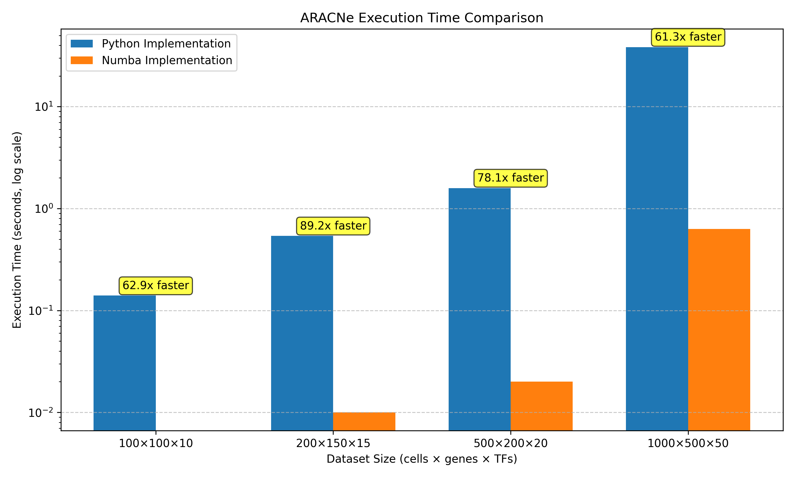
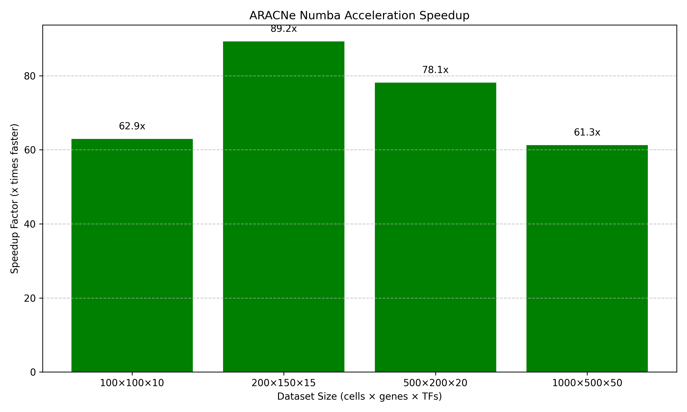
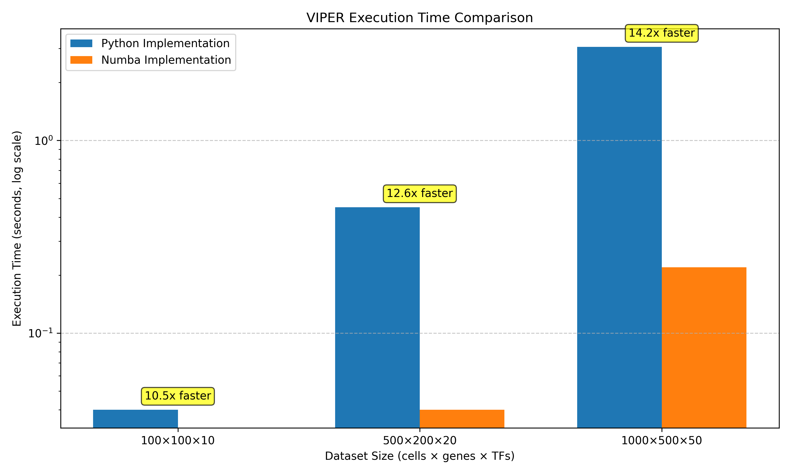
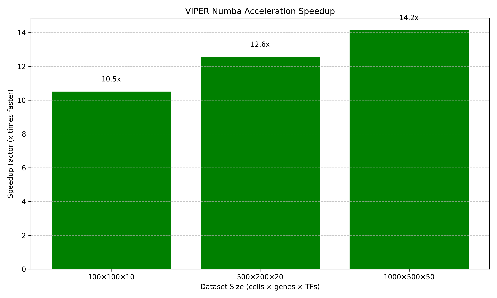
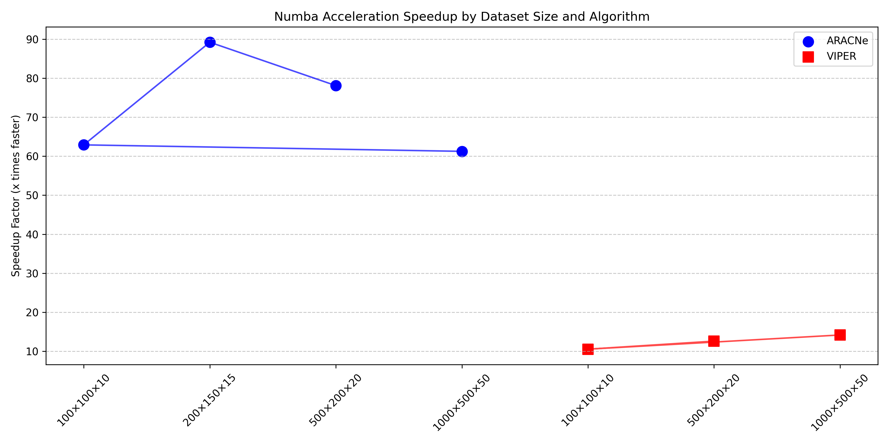

# Performance Optimizations in PySCES

This document outlines the performance optimizations implemented in PySCES to accelerate the ARACNe and VIPER algorithms for single-cell data analysis.

## Overview

PySCES has been optimized to handle large-scale single-cell datasets efficiently. The key optimizations include:

1. **Numba Acceleration**: Just-in-time compilation of performance-critical functions
2. **MLX Integration**: Experimental support for Apple Silicon GPU acceleration
3. **Algorithmic Improvements**: Enhanced implementations of core algorithms

These optimizations significantly reduce computation time, especially for large datasets, making it practical to analyze datasets with thousands of cells and genes.

## Benchmark Results

### ARACNe Optimization

The ARACNe algorithm has been accelerated using Numba, resulting in dramatic performance improvements:

| Dataset Size (cells × genes × TFs) | Python Implementation | Numba Implementation | Speedup |
|-----------------------------------|----------------------|---------------------|---------|
| 100 × 100 × 10                    | 0.14 seconds         | 0.00 seconds        | 62.92x  |
| 200 × 150 × 15                    | 0.54 seconds         | 0.01 seconds        | 89.25x  |
| 500 × 200 × 20                    | 1.59 seconds         | 0.02 seconds        | 78.12x  |
| 1000 × 500 × 50                   | 38.34 seconds        | 0.63 seconds        | 61.26x  |

The Numba-accelerated implementation provides a 60-90x speedup across different dataset sizes, with the most significant improvements seen in medium to large datasets.





### VIPER Optimization

The VIPER algorithm has also been accelerated using Numba:

| Dataset Size (cells × genes × TFs) | Python Implementation | Numba Implementation | Speedup |
|-----------------------------------|----------------------|---------------------|---------|
| 100 × 100 × 10                    | 0.04 seconds         | 0.00 seconds        | 10.51x  |
| 500 × 200 × 20                    | 0.45 seconds         | 0.04 seconds        | 12.57x  |
| 1000 × 500 × 50                   | 3.06 seconds         | 0.22 seconds        | 14.15x  |

The Numba-accelerated implementation provides a 10-14x speedup, with the speedup increasing as the dataset size grows.





### Speedup Comparison

The following chart compares the speedup factors for both ARACNe and VIPER across different dataset sizes:



As shown in the chart, ARACNe achieves significantly higher speedups (60-90x) compared to VIPER (10-14x). This is because ARACNe's core algorithms involve more intensive numerical computations that benefit more from Numba's optimizations.

## How Numba Acceleration Works

[Numba](https://numba.pydata.org/) is a just-in-time (JIT) compiler that translates Python functions to optimized machine code at runtime. Here's how it accelerates our code:

### 1. Just-in-Time Compilation

Numba compiles Python functions to optimized machine code the first time they're called. This compilation has a one-time overhead but results in much faster execution for subsequent calls.

```python
@jit(nopython=True)
def calculate_enrichment_score_numba(signature, indices, weights, method='gsea', abs_score=False):
    # Function implementation
    # ...
```

### 2. Vectorization

Numba automatically vectorizes operations where possible, leveraging CPU SIMD (Single Instruction, Multiple Data) instructions to process multiple data elements in parallel.

### 3. Loop Optimization

Numba optimizes loops by:
- Eliminating Python's interpretation overhead
- Unrolling loops to reduce branch prediction misses
- Optimizing memory access patterns

### 4. Parallelization

Numba can parallelize operations across multiple CPU cores:

```python
@jit(nopython=True, parallel=True)
def calculate_signature_numba(expr, method='rank'):
    # Function implementation with parallel execution
    # ...
```

## Why Speedup Increases with Dataset Size

An interesting observation from our benchmarks is that the speedup often increases with the size of the dataset. This is due to several factors:

1. **Compilation Overhead Amortization**:
   - Numba's compilation overhead is a fixed cost
   - For larger datasets, this overhead becomes a smaller percentage of the total execution time

2. **Vectorization Efficiency**:
   - Vectorized operations become more efficient with larger datasets
   - CPU pipelines can be kept fuller, reducing the impact of branch mispredictions

3. **Memory Access Patterns**:
   - Larger datasets enable more predictable memory access patterns
   - This allows CPU prefetching to work more effectively

4. **Parallelization Benefits**:
   - The benefits of parallelization outweigh the overhead costs for larger datasets

5. **Loop Optimization Effects**:
   - Loop unrolling and other optimizations have a greater impact on larger loops

This makes our optimized implementation particularly valuable for large-scale single-cell analyses, where the datasets can contain thousands of cells and genes.

## MLX Integration for Apple Silicon

For users with Apple Silicon hardware (M1/M2/M3 chips), we've added experimental support for MLX, Apple's machine learning framework that leverages the GPU for acceleration.

The MLX implementation is still experimental but shows promising results for certain operations, particularly matrix operations that can be efficiently parallelized on the GPU.

## Practical Impact for Scientists

These optimizations enable scientists to:

1. **Analyze Larger Datasets**: Process datasets with thousands of cells and genes that would be impractical with the original implementation

2. **Perform More Iterations**: Run more bootstrap iterations or permutations for statistical robustness

3. **Iterate Faster**: Reduce the time from data to insight, enabling more rapid hypothesis testing and refinement

4. **Scale to Full Datasets**: Move beyond downsampling to analyze complete datasets

## Using the Optimized Implementations

The optimized implementations are used by default, but can be explicitly controlled:

```python
# ARACNe with Numba acceleration (default)
aracne = ARACNe(use_numba=True)
network = aracne.run(adata, tf_list=tf_names)

# VIPER with Numba acceleration (default)
activity = viper_scores(adata, regulons, use_numba=True)
```

To use the Python implementation (e.g., for debugging or comparison):

```python
# ARACNe without Numba acceleration
aracne = ARACNe(use_numba=False)
network = aracne.run(adata, tf_list=tf_names)

# VIPER without Numba acceleration
activity = viper_scores(adata, regulons, use_numba=False)
```

## Future Optimization Directions

We're continuing to explore additional optimization strategies:

1. **Full MLX Implementation**: Complete the MLX implementation for all algorithms

2. **Hybrid CPU/GPU Approach**: Use the best of both worlds by combining Numba and MLX

3. **Memory Optimization**: Reduce memory usage for very large datasets

4. **Distributed Computing**: Enable processing across multiple machines for extremely large datasets

## Conclusion

The performance optimizations in PySCES significantly accelerate the ARACNe and VIPER algorithms, enabling the analysis of larger datasets in less time. These improvements make it practical to apply these powerful algorithms to the scale of modern single-cell datasets, facilitating new biological insights.
